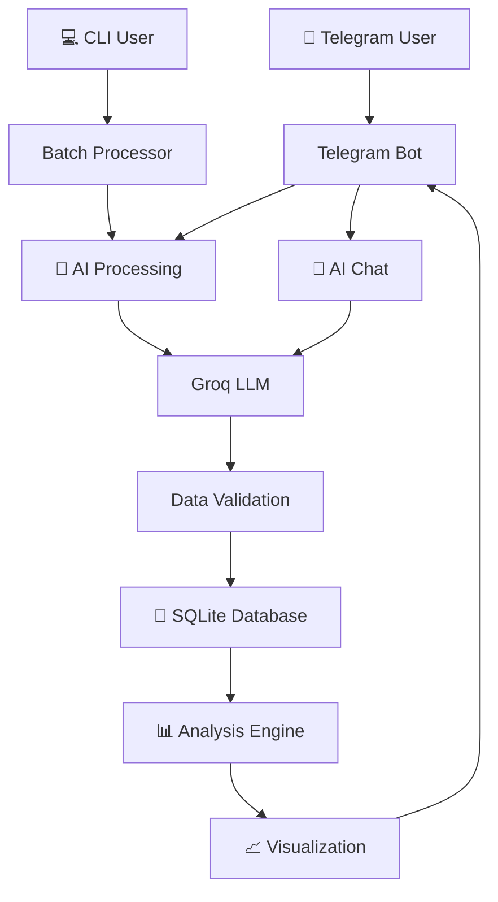

# 🧾 UrFinance - Your Friendly Expense Tracker

A powerful AI-powered invoice processing system that helps you track your spending effortlessly. Simply snap a photo of any receipt, and let AI extract all the details, analyze your spending patterns, and keep you within budget.

Perfect for personal finance tracking, expense management, and staying on top of your monthly spending!

---

## 🚀 Quick Deploy

**Deploy to Railway.app in 5 minutes:**

[](https://railway.app)

1. Click button above or visit [railway.app](https://railway.app)
2. Connect your GitHub repository
3. Add environment variables (Bot Token + API Key)
4. Deploy! ✅

📖 **Deployment Guide:** [deployment/RAILWAY_QUICKSTART.md](invoice_rag/deployment/RAILWAY_QUICKSTART.md) | [Full Documentation](invoice_rag/deployment/RAILWAY_DEPLOYMENT.md)

---

## �📚 Documentation

Complete documentation is now organized in the `docs/` folder:

- **[Documentation Index](invoice_rag/docs/README.md)** - � Main documentation hub
- **[Setup Guide](invoice_rag/docs/SETUP.md)** - ⚙️ Installation and configuration
- **[Features Overview](invoice_rag/docs/FEATURES.md)** - ✨ All features and capabilities
- **[User Workflows](invoice_rag/docs/USER_WORKFLOWS.md)** - 📱 Step-by-step usage guides
- **[Quick Reference](invoice_rag/docs/QUICK_REFERENCE.md)** - � Fast command reference

**Additional Guides:**

- [Dashboard Guide](invoice_rag/docs/guides/DASHBOARD_GUIDE.md)
- [Export Guide](invoice_rag/docs/guides/EXPORT_GUIDE.md)
- [Testing Guide](invoice_rag/docs/guides/TESTING_GUIDE.md)
- [Troubleshooting](invoice_rag/docs/troubleshooting/)

---

## 🎯 What Can You Do?

### 📱 Via Telegram Bot (Interactive)

- **📸 Snap & Track**: Take a photo of any receipt → AI extracts all details automatically
- **📊 Visual Insights**: Get beautiful dashboards showing spending trends, top vendors, and patterns
- **💰 Budget Tracking**: Set monthly limits and get alerts when you're close to exceeding them
- **🤖 AI Assistant**: Ask questions like "How much did I spend on groceries?" or "Show me my biggest expenses"
- **📋 Quick Reports**: View recent invoices, spending summaries, and budget status instantly

### 💻 Via Command Line (Batch Processing)

- **🔄 Bulk Processing**: Process dozens of invoices at once from a folder
- **⚡ Fast & Efficient**: Perfect for catching up on historical receipts
- **🗄️ Database Storage**: All data saved to SQLite for analysis

## 🚀 Core Features

### Intelligent Data Extraction

- **🤖 AI-Powered OCR**: Uses Groq LLM (Meta-Llama models) to extract structured data from images
- **✅ Smart Validation**: Automatically handles various date formats, currency notations, and transaction types
- **� Multi-Format Support**: Works with JPG, JPEG, and PNG images
- **🏷️ Auto-Categorization**: Detects transaction type (Bank/Retail/E-commerce) automatically

### Financial Analysis & Insights

- **� Comprehensive Dashboard**: 4-panel KPI dashboard with spending trends, top vendors, and budget status
- **📈 Smart Visualization**: Color-coded charts showing daily/weekly patterns, transaction types, and spending distribution
- **� Budget Management**: Set monthly limits with automatic alerts at 90% and 100% usage
- **🎯 AI-Powered Chat**: Ask questions about your spending and get intelligent insights
- **� Quick Reports**: Instant access to recent invoices, summaries, and spending breakdowns

### Flexible Interfaces

- **� Telegram Bot**: Your personal finance assistant on-the-go

  - 📸 Upload invoices with a photo
  - 📊 View visual dashboards
  - 💬 Chat with AI for insights
  - 💰 Track budget in real-time
  - � Quick access to recent transactions
- **💻 Command Line**: Batch processing for power users

  - 🔄 Process multiple invoices at once
  - ⚡ Fast bulk imports
  - 🖥️ Direct database access

## 📁 Project Structure

```
hackathon/
├── README.md                      # This guide
└── invoice_rag/                   # Main application
    │
    ├── src/                       # 🧠 Core Logic
    │   ├── processor.py           # AI invoice extraction & validation
    │   ├── database.py            # Database models & utilities
    │   ├── analysis.py            # Financial analysis engine
    │   └── chatbot.py             # AI conversation handler
    │
    ├── telegram_bot/              # 📱 Telegram Interface
    │   ├── bot.py                 # Main bot with all commands
    │   ├── visualizations.py      # Dashboard & chart generation
    │   └── spending_limits.py     # Budget tracking logic
    │
    ├── database/                  # 💾 Database Storage
    │   └── invoices.db            # SQLite database
    │
    ├── tests/                     # ✅ Test Suite
    │   ├── conftest.py            # pytest configuration
    │   ├── test_api.py            # API tests
    │   ├── test_analysis.py       # Analysis tests
    │   ├── test_bot.py            # Bot tests
    │   └── ...                    # More test files
    │
    ├── docs/                      # 📚 Documentation
    │   ├── README.md              # Documentation index
    │   ├── SETUP.md               # Setup guide
    │   ├── FEATURES.md            # Features overview
    │   ├── guides/                # User guides
    │   ├── troubleshooting/       # Problem-solving
    │   └── archive/               # Historical docs
    │
    ├── migration/                 # 🔄 Database Migration
    │   ├── migrate.py             # Migration utilities
    │   └── README.md              # Migration guide
    │
    ├── invoices/                  # 📸 Invoice images (for CLI batch processing)
    │
    ├── requirements.txt           # 📦 Python dependencies
    ├── .env.example               # 🔑 Configuration template
    ├── run_bot.py                 # ▶️ Start Telegram bot
    ├── run.py                     # ▶️ Batch process invoices
    ├── cleanup.py                 # 🧹 Database cleanup utility
    ├── backup_database.py         # 💾 Database backup utility
    └── check_database.py          # 🔍 Database inspection tool
```

## 📚 User Workflows

For detailed step-by-step workflows with visual diagrams, see **[docs/USER_WORKFLOWS.md](invoice_rag/docs/USER_WORKFLOWS.md)**

### Quick Overview

**📱 Telegram Bot - Daily Use:**

1. Take photo of receipt
2. Send to bot
3. Get instant confirmation
4. Check `/analysis` for insights
5. Set budget with `/set_limit`

**💻 CLI - Batch Processing:**

1. Put all images in `invoices/` folder
2. Run `python run.py`
3. All invoices processed & saved
4. View results via Telegram bot

**🤖 AI Chat:**

- `/chat How much did I spend this week?`
- `/chatmode on` for continuous conversation
- Ask any question about your finances

## 🛠️ Installation & Setup

### 1. Clone & Navigate

```bash
git clone <your-repo-url>
cd hackathon/invoice_rag
```

### 2. Install Dependencies

```bash
# Using pip (recommended)
pip install -r requirements.txt

# Using uv (faster alternative)
uv pip install -r requirements.txt
```

### 3. Environment Setup (2 minutes)

Create and configure your environment file:

```powershell
# Copy template
cp .env.example .env

# Edit .env with your keys
notepad .env
```

**Required Configuration:**

```env
# AI API Key (for invoice extraction)
GROQ_API_KEY="your_groq_api_key_here"

# Telegram Bot Token
TELEGRAM_BOT_TOKEN="your_telegram_bot_token_here"

# Optional: AI Model Selection
OCR_MODEL="meta-llama/llama-4-scout-17b-16e-instruct"
```

**🔑 Getting Your API Keys:**

**1. Groq API Key** (Free tier available)

- Visit [Groq Console](https://console.groq.com/)
- Sign up for free account
- Generate API key
- Copy to `.env` file

**2. Telegram Bot Token** (Free)

- Open Telegram
- Search for [@BotFather](https://t.me/botfather)
- Send `/newbot`
- Follow instructions to create bot
- Copy token to `.env` file

**That's it!** You're ready to go 🚀

## 🚀 Quick Start Guide

### Option 1: Telegram Bot (Recommended for Daily Use) 📱

**Start the bot:**

```powershell
cd invoice_rag
python run_bot.py
```

**Then on Telegram:**

1. Open your bot in Telegram
2. Send `/start` to begin
3. Take a photo of any receipt and send it
4. Get instant analysis with `/analysis`
5. Set your budget: `/set_limit 5000000` (5 million Rupiah)
6. Ask questions: `/chat How much did I spend this week?`

**Essential Commands:**

| Command                 | What It Does                     |
| ----------------------- | -------------------------------- |
| `/start`              | Show welcome & menu              |
| `/analysis`           | View spending dashboard & charts |
| `/recent_invoices`    | Last 5 transactions              |
| `/set_limit <amount>` | Set monthly budget               |
| `/check_limit`        | Check budget status              |
| `/chat <question>`    | Ask AI about your spending       |
| `/chatmode on/off`    | Enable continuous AI chat        |
| `/help`               | Full command list                |

**💡 Pro Tip:** Just send photos directly - no command needed!

---

### Option 2: Batch Processing (For Multiple Invoices) 💻

**Process many invoices at once:**

```powershell
# 1. Put all invoice images in invoices/ folder
cd invoice_rag
mkdir invoices  # if not exists
# Copy your images to invoices/

# 2. Run batch processor
python run.py
```

**What happens:**

- ✅ All images in `invoices/` folder are processed
- ✅ AI extracts data from each invoice
- ✅ Everything saved to database
- ✅ View results via Telegram bot `/analysis`

**Perfect for:**

- Processing historical receipts
- Catching up on backlog
- Importing old invoices

---

### Complete Example Workflow

**First Time Setup (5 minutes):**

```powershell
# 1. Setup environment (one-time)
cd invoice_rag
pip install -r requirements.txt
cp .env.example .env
# Edit .env with your API keys

# 2. Start bot
python run_bot.py

# 3. On Telegram
# - Send /start
# - Send /set_limit 5000000
# - Take photo of receipt → send it
# - Send /analysis to see dashboard
```

**Daily Usage:**

1. 📸 Take photo of receipt
2. 📤 Send to bot
3. ✅ Get confirmation
4. 📊 (Optional) Check `/analysis` weekly

## 🎨 What You Get: Dashboard Features

### 📊 Comprehensive Visual Dashboard

When you send `/analysis`, you receive a beautiful 4-panel dashboard:

**4 KPI Cards:**

1. 💰 **Total Spending** - Your total expenses
2. 📊 **Weekly Average** - Average per week
3. 🏪 **Top Vendor** - Where you spend most
4. 💳 **Budget Status** - Color-coded progress (🟢/🟠/🔴)

**Visual Charts:**

- 📈 **Spending Trend** - See patterns over time
- 🏬 **Top 5 Vendors** - Your most visited shops
- 💳 **Transaction Types** - Bank/Retail/E-commerce breakdown
- 📅 **Daily Spending** - Daily expense bars

**Smart Insights:**

- AI-generated observations
- Budget warnings
- Spending recommendations

### 🤖 AI Chat Assistant

Ask anything about your finances:

- "How much did I spend at Alfamart?"
- "What was my biggest purchase this month?"
- "Show me my grocery spending"
- "Am I spending more than last week?"

**Two Modes:**

- `/chat <question>` - One-off queries (saves API costs)
- `/chatmode on` - Continuous conversation

### 💰 Smart Budget Tracking

Set monthly limits and get automatic alerts:

- ✅ **Under 75%** - All good
- ⚡ **75-89%** - Getting close
- ⚠️ **90-99%** - Near limit warning
- 🚫 **100%+** - Over budget alert

## 📊 Database Schema

The database uses a simplified and robust schema to store invoice data.

### `invoices` Table

| Field                | Type      | Description                                  |
| -------------------- | --------- | -------------------------------------------- |
| `id`               | INTEGER   | Primary Key                                  |
| `shop_name`        | TEXT      | Name of the shop or vendor                   |
| `invoice_date`     | TEXT      | Date from the invoice (YYYY-MM-DD)           |
| `total_amount`     | REAL      | The final total amount of the invoice        |
| `transaction_type` | TEXT      | Type:`bank`, `retail`, or `e-commerce` |
| `processed_at`     | TIMESTAMP | Timestamp when the invoice was processed     |
| `image_path`       | TEXT      | Path to the original invoice image           |

### `invoice_items` Table

| Field           | Type    | Description                           |
| --------------- | ------- | ------------------------------------- |
| `id`          | INTEGER | Primary Key                           |
| `invoice_id`  | INTEGER | Foreign key to the `invoices` table |
| `item_name`   | TEXT    | Name of the purchased item            |
| `quantity`    | INTEGER | Quantity of the item                  |
| `unit_price`  | REAL    | Price per unit of the item            |
| `total_price` | REAL    | Total price for the line item         |

### `platform_users` Table (Multi-Platform Support)

| Field                | Type      | Description                                  |
| -------------------- | --------- | -------------------------------------------- |
| `id`               | INTEGER   | Primary Key                                  |
| `platform`         | TEXT      | Platform:`telegram` or `whatsapp`        |
| `platform_user_id` | TEXT      | User ID from platform (Telegram ID or Phone) |
| `display_name`     | TEXT      | User's display name                          |
| `phone_number`     | TEXT      | Phone number (for WhatsApp users)            |
| `created_at`       | TIMESTAMP | User creation timestamp                      |
| `last_active`      | TIMESTAMP | Last activity timestamp                      |

### `spending_limits_v2` Table (Enhanced)

| Field             | Type      | Description                             |
| ----------------- | --------- | --------------------------------------- |
| `id`            | INTEGER   | Primary Key                             |
| `user_id`       | INTEGER   | Foreign key to `platform_users.id`    |
| `monthly_limit` | REAL      | The spending limit amount for the month |
| `created_at`    | TIMESTAMP | Timestamp of creation                   |
| `updated_at`    | TIMESTAMP | Timestamp of the last update            |

## 🔄 System Architecture

Simple and efficient architecture for personal finance tracking:



**Key Components:**

1. **📱 Telegram Bot** - User interface for daily interaction
2. **💻 CLI Processor** - Batch processing for multiple invoices
3. **🤖 Groq AI** - Extracts structured data from images
4. **✅ Validation** - Ensures data accuracy & format consistency
5. **💾 Database** - Stores all invoice data
6. **📊 Analysis** - Generates insights & statistics
7. **📈 Visualization** - Creates beautiful dashboards
8. **🤖 AI Chat** - Answers questions about your spending

**Data Flow:**

1. User sends invoice photo
2. AI extracts: date, shop, amount, items
3. Data validated & standardized
4. Saved to database
5. Available for analysis & chat queries

## � Troubleshooting

### Common Issues & Solutions

**❌ Bot won't start**

```powershell
# Check if TELEGRAM_BOT_TOKEN is set
cat .env

# Verify token with BotFather on Telegram
# Make sure token is correct and bot is active
```

**❌ Image processing fails**

```
Possible causes:
- ✅ Check GROQ_API_KEY is valid
- ✅ Verify image is clear and readable
- ✅ Ensure image format is JPG/PNG
- ✅ Check file size (<20MB)
- ✅ Try better lighting/focus
```

**❌ "Failed to process invoice"**

```
Solutions:
1. Retake photo with better lighting
2. Ensure all text is readable
3. Avoid glare/shadows on receipt
4. Try straightening the image
```

**❌ Chat not responding**

```powershell
# Check if chat mode is enabled
/chatmode   # Shows current status

# Enable chat mode
/chatmode on

# Or use one-off queries
/chat Your question here
```

**❌ Budget not showing in dashboard**

```powershell
# Set budget first
/set_limit 5000000

# Then check
/check_limit
```

### 📞 Getting Help

1. **Check bot status**: Send `/help` to see if bot responds
2. **Verify API keys**: Ensure `.env` file has valid keys
3. **Check logs**: Look at `telegram_bot.log` for errors
4. **Test connection**: Use `/start` to reinitialize

### � Documentation

- **[USER_WORKFLOWS.md](invoice_rag/USER_WORKFLOWS.md)** - Detailed user guides with diagrams
- **[.env.example](invoice_rag/.env.example)** - Environment configuration template
- **[DASHBOARD_QUICK_GUIDE.md](invoice_rag/DASHBOARD_QUICK_GUIDE.md)** - Dashboard features explained

## 💡 Tips for Best Results

### 📸 Taking Good Invoice Photos

- ✅ Use good lighting (natural light works best)
- ✅ Keep phone steady and parallel to receipt
- ✅ Ensure all text is clearly visible
- ✅ Avoid shadows and glare
- ✅ Capture the entire receipt

### 💰 Budget Management

- Set realistic monthly limits
- Review weekly with `/analysis`
- Adjust budget based on trends
- Use alerts to control spending

### � Using AI Chat Effectively

- Keep chat mode OFF by default (saves API costs)
- Use `/chat` for specific questions
- Enable `/chatmode on` for detailed analysis sessions
- Clear history with `/clear` when done

### 📊 Analyzing Spending

- Check `/analysis` weekly
- Look for spending patterns
- Identify top vendors
- Set budgets for problem areas
- Use insights to adjust habits

## 🎓 Advanced Features

### Batch Processing Historical Data

```powershell
# Process all old receipts at once
cd invoice_rag
# Copy all images to invoices/ folder
python run.py
# View results via Telegram /analysis
```

### Database Direct Access

```powershell
# Check database contents
python check_database.py

# Location: invoice_rag/invoices.db
# Tool: Any SQLite viewer (DB Browser for SQLite, etc.)
```

## �🤝 Contributing

Contributions welcome! To add features:

1. Fork the repository
2. Create feature branch (`git checkout -b feature/amazing-feature`)
3. Make changes and test
4. Commit (`git commit -m 'Add amazing feature'`)
5. Push (`git push origin feature/amazing-feature`)
6. Open Pull Request

## 📝 License

This project is open source and available under the MIT License.

---

## 🎉 Ready to Start?

1. **Setup** (5 minutes): Install dependencies, configure `.env`
2. **Launch**: `python run_bot.py`
3. **Use**: Send `/start` on Telegram
4. **Track**: Upload receipts and monitor spending!

**📱 Start tracking your finances smarter today!** 💰✨

---

**Project:** AI Invoice Processing System
**Version:** 2.0
**Last Updated:** October 22, 2025
**Status:** ✅ Production Ready
