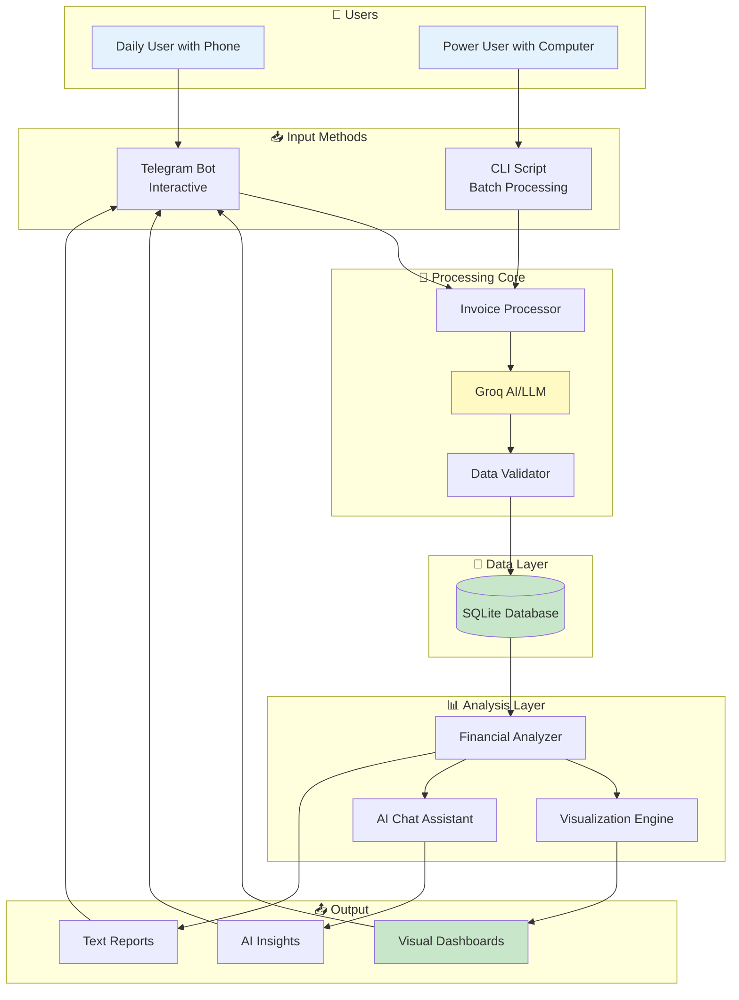
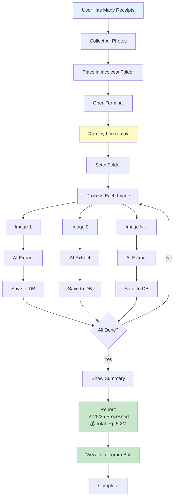
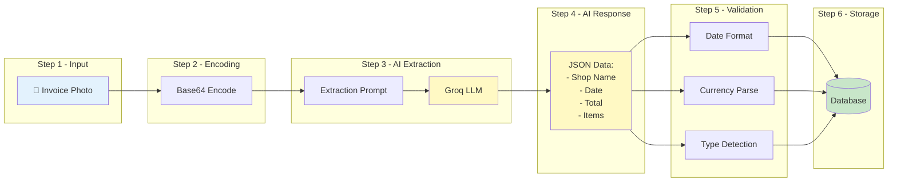
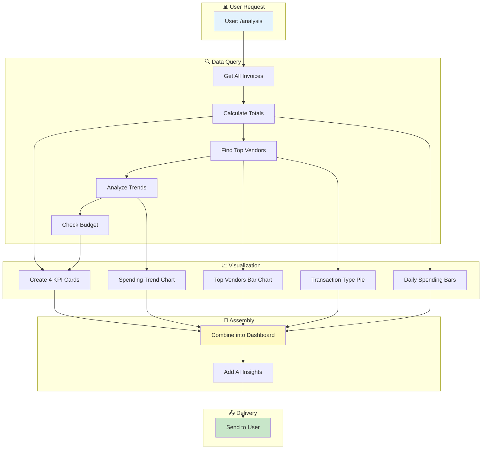
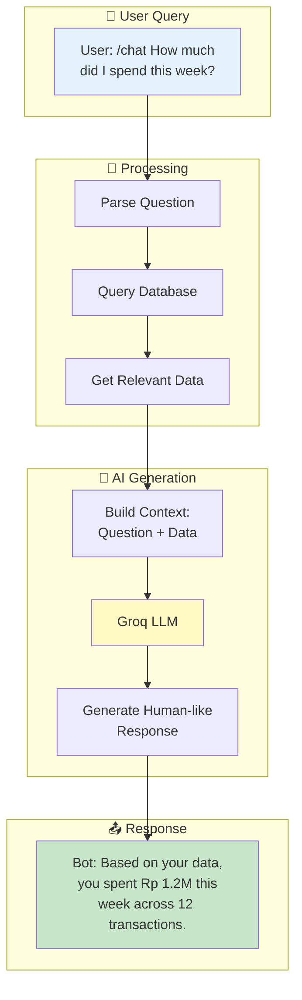
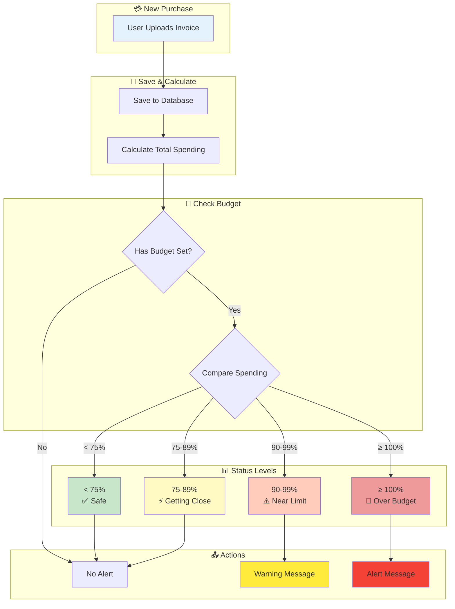
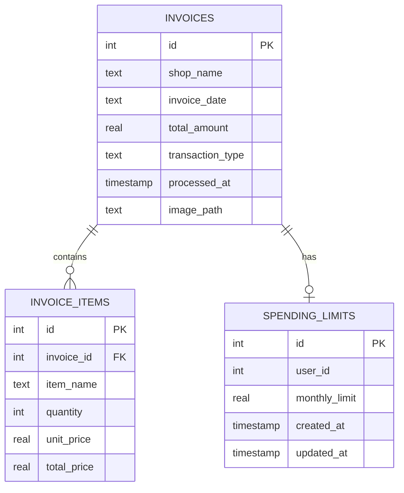
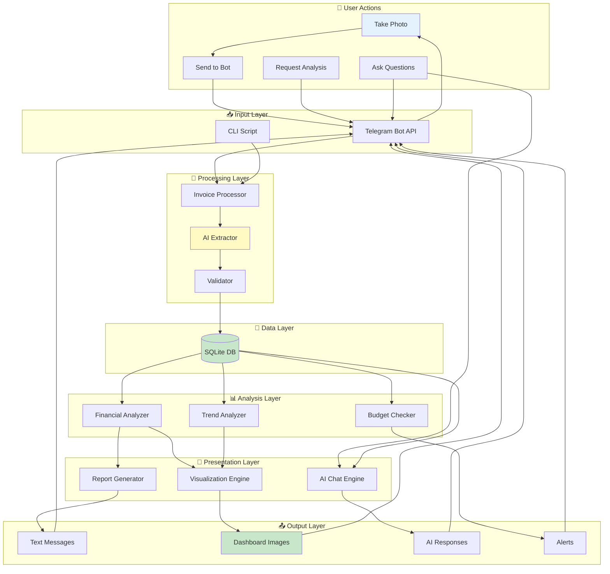

# 🔄 Invoice Processing System - Complete Workflow Overview

This document provides a comprehensive visual overview of how the Invoice Processing System works from start to finish.

---

## 🎯 System Overview



---

## 📱 Telegram Bot User Journey

### Complete Daily Workflow

```mermaid
graph TD
    START[User Starts Day] --> SHOP[Makes a Purchase]
    SHOP --> RECEIPT[Gets Receipt]
    RECEIPT --> PHOTO[Takes Photo]
    PHOTO --> SEND[Sends to Bot]
    
    SEND --> PROCESS[Bot: Processing...]
    PROCESS --> EXTRACT[AI Extracts Data]
    EXTRACT --> VALIDATE[Validates Info]
    VALIDATE --> SAVE[Saves to Database]
    
    SAVE --> CHECK{Check Budget}
    CHECK -->|Under Budget| OK[✅ Confirmation]
    CHECK -->|Near Limit| WARN[⚡ Warning]
    CHECK -->|Over Limit| ALERT[🚫 Alert]
    
    OK --> DONE[Invoice Saved]
    WARN --> DONE
    ALERT --> DONE
    
    DONE --> NEXT{User Action}
    
    NEXT -->|Continue Shopping| SHOP
    NEXT -->|Check Analysis| ANALYSIS[/analysis]
    NEXT -->|Ask Question| CHAT[/chat]
    NEXT -->|Check Budget| BUDGET[/check_limit]
    NEXT -->|Done| END[End]
    
    ANALYSIS --> DASH[📊 Dashboard Sent]
    CHAT --> AI_RESP[🤖 AI Response]
    BUDGET --> BUDGET_STATUS[💰 Budget Status]
    
    DASH --> END
    AI_RESP --> END
    BUDGET_STATUS --> END
    
    style START fill:#e3f2fd
    style PHOTO fill:#fff9c4
    style EXTRACT fill:#fff9c4
    style OK fill:#c8e6c9
    style WARN fill:#ffeb3b
    style ALERT fill:#ffccbc
    style DASH fill:#c8e6c9
```

---

## 💻 CLI Batch Processing Workflow

### Bulk Invoice Import



---

## 🤖 AI Processing Pipeline

### How Invoice Data is Extracted



**What AI Extracts:**
- 🏢 **Shop Name**: "Alfamart", "Indomaret", etc.
- 📅 **Date**: Standardized to YYYY-MM-DD
- 💰 **Total Amount**: Parsed from various formats
- 📝 **Line Items**: Individual products/services
- 🏷️ **Transaction Type**: Bank/Retail/E-commerce (auto-detected)

---

## 📊 Analysis & Visualization Flow

### From Data to Dashboard



---

## 🤖 AI Chat Interaction Flow

### Conversational Finance Assistant



**Chat Capabilities:**
- 📊 Spending queries: "How much did I spend?"
- 🏪 Vendor analysis: "Which shop do I visit most?"
- 📅 Time comparisons: "Compare this week to last week"
- 💡 Insights: "Where can I cut costs?"
- 🎯 Budget help: "Am I on track with my budget?"

---

## 💰 Budget Alert System

### Automatic Spending Monitoring



---

## 🗄️ Database Schema

### How Data is Stored



---

## 🔄 Complete System Data Flow

### End-to-End Process



---

## 📈 Typical Usage Patterns

### Daily User

```
Morning:
┌─────────────────────┐
│ 1. Buy breakfast    │
│ 2. Take photo       │
│ 3. Send to bot      │ → ✅ Saved
│ 4. Get confirmation │
└─────────────────────┘

Evening:
┌─────────────────────┐
│ 1. Grocery shopping │
│ 2. Send receipt     │ → ⚡ 85% budget warning
│ 3. Check /analysis  │
└─────────────────────┘

Weekend:
┌─────────────────────┐
│ 1. Review dashboard │
│ 2. Ask AI insights  │
│ 3. Adjust budget    │
└─────────────────────┘
```

### Power User

```
Monthly Setup:
┌────────────────────────┐
│ 1. Collect old receipts│
│ 2. Batch process CLI   │ → 50 invoices processed
│ 3. Set monthly budget  │
│ 4. Review dashboard    │
└────────────────────────┘

Ongoing:
┌────────────────────────┐
│ • Upload as you shop   │
│ • Weekly analysis      │
│ • AI trend questions   │
│ • Budget adjustments   │
└────────────────────────┘
```

---

## 🎯 Success Metrics

**What Users Achieve:**
- 📊 **100% Transaction Tracking**: Never miss an expense
- ⏱️ **30 Second Processing**: From photo to saved data
- 💰 **Budget Compliance**: Stay within limits with alerts
- 📈 **Pattern Recognition**: Understand spending habits
- 💡 **Actionable Insights**: AI-powered recommendations

---

## 🔗 Related Documentation

- **[README.md](../README.md)** - Main project documentation
- **[USER_WORKFLOWS.md](USER_WORKFLOWS.md)** - Detailed user guides
- **[DASHBOARD_QUICK_GUIDE.md](DASHBOARD_QUICK_GUIDE.md)** - Dashboard features
- **[.env.example](.env.example)** - Configuration template

---

**Ready to track your spending?** Start with `python run_bot.py` 🚀
